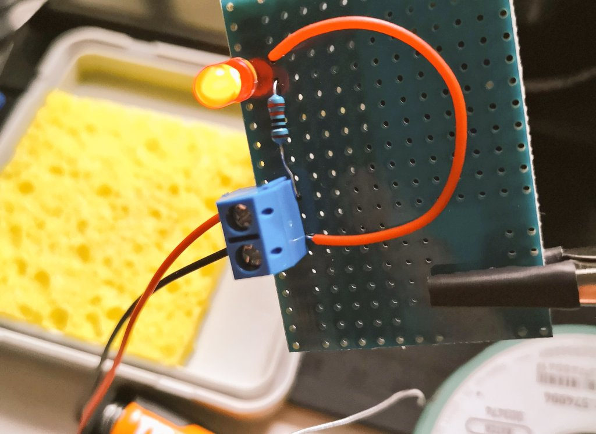

# 100 Days Of Hardware - Log

2023


2024


{::nomarkdown}

...

{:/}

## Day 1: 2023-04-15

[Tweet](https://twitter.com/BudavariMatyas/status/1647243754212933633)

**Today's Progress**: `#100DaysOfHardware` Day 1

I've set up a `@docusaurus`  site to gather my knowledge over there.

- Inventory of my current available items and components
- Project ideas to stay on track
- Project instructables on how to recreate them
- My tutorials on the hardware I already own

**Thoughts**: It's nice to get started with a clear state of mind, with some goals in mind of what I want to achieve. I have the base building blocks, I'm looking forward to see what I can make out of them.

## Day 2: 2023-04-16

[Tweet](https://twitter.com/BudavariMatyas/status/1647537684133412865)

**Today's Progress**: `#100DaysOfHardware` Day 2

📚 I spent time revisiting the basics from what I've learned in Electronics class in high school

🧠 I added a Theory tutorial section

🩹 I embedded a plain simple Resistor Band Color calculator into the site

🛠️ I revisited how to use the multimeter

**Thoughts**: I spent way too much time implementing that calculator, but now I have better sections, and I can add any react code from now on.

## Day 3: 2023-04-17

[Tweet](https://twitter.com/BudavariMatyas/status/1648073274457309187)

**Today's Progress**: `#100DaysOfHardware` Day 3

📚 I finished going through my inventory and added a page for all items

🖋️ I started to look into how to connect the eink display to raspberry pi

💾 I collected and reviewed some demo source code for testing it out later

**Thoughts**: It was a loooong day

## Day 4: 2023-04-18

[Tweet](https://twitter.com/BudavariMatyas/status/1648403408741707777)

**Today's Progress**: `#100DaysOfHardware` Day 4

🗺️ I've started to put together a simpler project to practice how I'll work through my ideas

🚦 This project is just going to check status info from the network and light up LEDs accordingly

🛹 I've sketched the code and planned the circuit diagram

**Thoughts**:

## Day 5: 2023-04-22

[Tweet](https://twitter.com/BudavariMatyas/status/1649884631582253059)

**Today's Progress**: `#100DaysOfHardware` Day 5

🚨  As a practice I've blinked a LED again to get astarted

👋 I connected the PIR for movement detection, blinked the lights on that

🙄 I connected the eInk display to refresh data based on movement, but sadly I see many people were struggling as well

**Thoughts**:

## Day 6: 2023-05-01

[Tweet](https://twitter.com/BudavariMatyas/status/1653026148110958594)

**Today's Progress**: `#100DaysOfHardware` Day 6

🔧 At last I figured out the problem with the e-ink Display. The wiring was too loose

🍞 I added an extra layer on the breadboard between the 2 sets of wires to fix them together

🖼️ I played around with the PIL library to display text and images

**Thoughts**: I had an idea that it could be a problem, and so it was. It works flawlessly. 2 of my wires broke in the process, and I set up remote development with raspberry VSCode remote SSH.

## Day 7: 2023-05-02

[Tweet](https://twitter.com/BudavariMatyas/status/1653282990426927105)

**Today's Progress**: `#100DaysOfHardware` Day 7

📏 My app'll have a display, and I'll debug image positions a lot. I don't want to develop on hardware

🤓 I've set up a dev env. I've configured ssh with X11 forwarding, rsync for code sharing

🎁 VScode remote plugin doesn't give enough benefits yet

**Thoughts**: I thought VSCode remote will be the way, but I like X11 way more. I collect my knowledge and might even post a blog about my setup

## Day 8: 2023-05-23

[Tweet](https://twitter.com/BudavariMatyas/status/1661067193872793621)

**Today's Progress**: `#100DaysOfHardware` Day 8

⏭️ Today I wanted to learn more about what could be the next steps of a prototype

👨‍🎓 I refreshed my high school knowledge on how to draw the circuit, what is a PCB protoboard, what is a PCB

👨‍🔧 Looked into how to solder, what equipment do I need for it

**Thoughts**: bunh of reading, some knowledge management

## Day 9: 2023-06-03

[Tweet](https://twitter.com/BudavariMatyas/status/1665079614996205568)

**Today's Progress**: `#100DaysOfHardware` Day 9

🍓 Today I've tried out my Raspberry PI Pico W

🐍 I set up micropython on it via CLI from my rpi4. Later I used Thonny via X Window for development

🔋 I loaded the code into the device and ran it from a battery pack

🤓 I'm sooo excited!🤩

**Thoughts**: WOOOOW

## Day 10: 2023-06-04

[Tweet](https://twitter.com/BudavariMatyas/status/1665431026263379970)

**Today's Progress**: `#100DaysOfHardware` Day 10

☀️ Summer is here, and I have to prepare for the heat

🌪️ I've dusted off my micro:bit and put together a circuit to have a button-controlled fan

🌊 Finally (after ~3 years) I tested my submersible water pumps, to see if all of them work fine with 5V

**Thoughts**: I was happy to see that the pumps work. 3V is not enough for them/

## Day 11: 2023-06-05

[Tweet](https://twitter.com/BudavariMatyas/status/1665827172727259138)

**Today's Progress**: `#100DaysOfHardware` Day 11

🙄 I looked for inspiration for useful projects around home

🐰 I'd be happy to build a a scheduled pet feeder with refill notifications

🍽️ I looked into how our LED strips work, whether I could utilize them as an extra light source in the kitchen

**Thoughts**:

## Day 12: 2023-06-15

[Tweet](https://twitter.com/BudavariMatyas/status/1669433800844103704)

**Today's Progress**: `#100DaysOfHardware` Day 12

🚦 Got a green light for the kitchen LED strip project

📋 I planned the final layout

🛒 I ordered the missing pieces 🤩

**Thoughts**:

## Day 13: 2023-06-19

[Tweet](https://twitter.com/BudavariMatyas/status/1670897662730678272)

**Today's Progress**: `#100DaysOfHardware` Day 13

🛒 I got the ordered pieces

👨‍🔧 I joined the wires while properly sealing them

🎉 I connected the led strip to the prepared cables

📼 I glued it to its final location

It may be plain simple but it's my first usable home improvement project so far 🎊

**Thoughts**:

## Day 14: 2023-06-20

[Tweet](https://twitter.com/BudavariMatyas/status/1671276231269007361)

**Today's Progress**: `#DaysOfHardware` Day 14

🏍️ I wired up the servo and my 5V motor to the raspberry and ran them from external battery

🌉  I started to look into how the L9110 motor driver module works

**Thoughts**:

## Day 15: 2023-06-24

[Tweet](https://twitter.com/BudavariMatyas/status/1672673816567218176)

**Today's Progress**: `#100DaysOfHardware` Day 15

👨🏻‍💻 Finally I set up the pi HAT development board with my raspberry pi pico

🔀 The cable is twisted compared to what I expected

✨ I hope it'll make prototyping easier

**Thoughts**:

## Day 16: 2023-06-25

[Tweet](https://twitter.com/BudavariMatyas/status/1672871591359725568)

**Today's Progress**: `#100DaysOfHardware` Day 16

🚨 I've tried the mini PIR motion detector (U1 HW-740)

👨🏻‍💻 I can use the same code and it works from 3V

⌚ It's duration and sensitivity is not configurable, it's slower and had less range

🏃🏻‍♂️ For my motion sensing use-case it seems fine

**Thoughts**:

## Day 17: 2023-07-08

[Tweet](https://twitter.com/BudavariMatyas/status/1677657344820256769)

**Today's Progress**: `#100DaysOfHardware` day 17

I started to work on my custom picture frame that'll have LED background lighting, it can have motion sensors and a light sensor.

My custom black and white images will come into life by the backlighting

(Inspired by Hwang Seontae)

**Thoughts**:

## Day 18: 2023-09-01

[Tweet](https://twitter.com/BudavariMatyas/status/1697693678607700375)

**Today's Progress**: `#100DaysOfHardware` Day 18

👨‍🔧 Finally I had some time to tinker a bit

💡 I've tried out my PioLED display

🍓 My raspberry dev environment needed some upgrades

📄 I've spent some timpe updating my docs to make my life easier later

**Thoughts**:

## Day 19: 2023-09-16

[Tweet](https://twitter.com/BudavariMatyas/status/1703002573244895700)

**Today's Progress**: `#100DaysOfHardware` day 19

New batch of parts have arrived, now I can dive into sound playing and radiofreq 🎉

Though I did not check properly the connection types of the parts so I got some SMD parts, that are not immediately suitable for my breadboard.

I've learned my lesson

**Thoughts**:

## Day 20: 2023-09-17

[Tweet](https://twitter.com/BudavariMatyas/status/1703436912235614704)

**Today's Progress**: `#100DaysOfHardware` Day 20

I've played around with my epaper module with raspberry pi pico to display quotes from a shuffled list

**Thoughts**:

## Day 21: 2023-09-18

[Tweet](https://twitter.com/BudavariMatyas/status/1703809500216475731)

**Today's Progress**: `#100DaysOfHardware` Day 21

Today I tried out my joystick component with my raspberry pi pico.

I got the right values without an external ADC.

**Thoughts**:

## Day 22: 2023-09-22

[Tweet](https://twitter.com/BudavariMatyas/status/1705322524769198511)

**Today's Progress**: `#100DaysOfCode` Day 22

I've tried out my new DFPlayer mini  with my raspberry pi pico H to play music from an SD card

Shoutout and thanks for mannbro github user for the easy to use library he put together

**Thoughts**:

<video width="320" height="240" controls>
<source src="assets/day-22.mp4" type="video/mp4">
Your browser does not support the video tag...
</video>

## Day 23: 2023-09-22

[Tweet](https://twitter.com/BudavariMatyas/status/1705347446866407894)

**Today's Progress**: `#100DaysOfHardware` Day 23

🎨 I got started with prototype drawing, to make my experiments easier to reproduce

🗃️ What I love in the opensource community is that if something is not available, there could be someone who uploaded it somewhere just to make the components available

**Thoughts**:

## Day 24: 2023-11-01

[Tweet](https://twitter.com/BudavariMatyas/status/1719721224006201574)

**Today's Progress**: `#100DaysOfHardware` Day 24

💻 I spinned up an mqtt server and started to learn (best) practices using it for IoT projects

🏁 We assembled our team for the upcoming hackathon where we'll build an AI powered cloud connected gadget.

**Thoughts**:

## Day 25: 2023-11-12

[Tweet](https://twitter.com/BudavariMatyas/status/1723788824700961072)

**Today's Progress**: `#100DaysOfHardware` Day 25

🐍 I've installed micropython on the ESP32

🎛️ I set up a proper dev environment for it

🎲 I can send random data to the MQTT broker

**Thoughts**:

## Day 26: 2024-01-05

[Tweet](https://twitter.com/BudavariMatyas/status/1743312855527485591)

**Today's Progress**: `#100DaysOfHardware` day 26

🐍 Tried out my new nodemcu ESP-32S with micropython

🌈 Connected an RGB led with PWM

🙋‍♂️ Handled button interruptions

`#100DaysOfCode` `#cablePorn`

**Thoughts**:

<video width="320" height="240" controls>
<source src="assets/day-26.mp4" type="video/mp4">
Your browser does not support the video tag...
</video>

## Day 27: 2024-01-06

[Tweet](https://twitter.com/BudavariMatyas/status/1743574090521202964)

**Today's Progress**: `#100DaysOfHardware` Day 27

📺 I've added an LCD screen to yesterday's code

🗣️ Dove deeper into I2C communication protocol

**Thoughts**:

<video width="320" height="240" controls>
<source src="assets/day-27.mp4" type="video/mp4">
Your browser does not support the video tag...
</video>

## Day 28: 2024-01-10

[Tweet](https://twitter.com/BudavariMatyas/status/1745208201832722706)

**Today's Progress**: `#DaysOfHardware` Day 28

☸️ Today I connected a joystick to control 2 servos

⚡ By accident I learned more about analog to digital conversion. I had an issue with ESP32 not seeing the whole range of the joystick, apparently by default it only reads a fraction of the whole range

**Thoughts**:

<video width="320" height="240" controls>
<source src="assets/day-28.mp4" type="video/mp4">
Your browser does not support the video tag...
</video>

## Day 29: 2024-01-11

[Tweet](https://twitter.com/BudavariMatyas/status/1745561302716534993)

**Today's Progress**: `#100DaysOfHardware` Day 29

📶 We connected all i2c sensors to the microcontroller, validated their addresses and started to get data out of them

🧭 We connected a gps sensor through UART and got surprised about the bad quality of the signal inside the building

**Thoughts**:

## Day 30: 2024-01-18

[Tweet](https://twitter.com/BudavariMatyas/status/1748065859694661818)

**Today's Progress**: `#100DaysOfHardware` Day 30

👷 I've improved my pipeline to only upload code that has changes. I use ampy with my relatively large (more than 2 files) codebase

🌪️ I also added a smoke test to see whether the code starts up properly and reaches the end of the 1st iteration

**Thoughts**:

## Day 31: 2024-01-19

[Tweet](https://twitter.com/BudavariMatyas/status/1748428682887114944)

**Today's Progress**: `#100DaysOfHardware` Day 31

I'm starting to get desperate and demotivated by the readings of this sensor so much that I switched from esp to arduino to test other libs

I have no idea whether it works correctly or my calibration is bad

**Thoughts**:

## Day 32: 2024-01-20

[Tweet](https://twitter.com/BudavariMatyas/status/1748631474981503328)

**Today's Progress**: `#100DaysOfHardware` Day 32

🔧 Turns out my problem was with the calibration and smoothing the data

♾️ After I used slow infinity shaped rotation, to make sure I get proper values for the calibration, North appeared where I expected

**Thoughts**:

## Day 33: 2024-01-22

[Tweet](https://twitter.com/BudavariMatyas/status/1749515697632272773)

**Today's Progress**: `#100DaysOfHardware` Day 33

🔦 Today I've tried out different photoresistors on how well they would fit my usage needs

🌞 I struggled with which pins shall I use. When I tried Pin 4 it made the internal led bright as the sun

**Thoughts**:

## Day 34: 2024-01-23

[Tweet](https://twitter.com/BudavariMatyas/status/1749906460509630468)

**Today's Progress**: `#100DaysOfHardware` Day 34

🚘 I haven't found a micropython driver for INA3221 that works with my ESP32 via I2C, so I started to port one from arduino

📚 I dove deeper into its datasheet and progressed slowly not to fry it unintentionally

**Thoughts**:

## Day 35: 2024-02-01

[Tweet](https://twitter.com/BudavariMatyas/status/1753197104967598329)

**Today's Progress**: `#100DaysOfHardware` Day 35

🧸 I had some fun with my new toys

💊 I created an animated text scrolling through the famous quote of Morpheus

**Thoughts**:

## Day 36: 2024-02-10

[Tweet](https://twitter.com/BudavariMatyas/status/1756275479366000841)

**Today's Progress**: `#100DaysOfHardware` Day 36

🏁 We participated in an internal IoT hackathon

🌻 We made a custom sun tracker solar panel with sensors and a data pipeline to measure its efficiency

📚 Stack: Micropython, Telegraf, Influxdb v2, Grafana, React.js, 3D Printing

🥉 We got 3rd place 🎉

**Thoughts**:

## Day 37: 2024-02-25

[Tweet](https://twitter.com/BudavariMatyas/status/1761803998942605672)

**Today's Progress**: `#100DaysOfHardware` Day 37

🪖 Today made my very first soldered circuit

💡 Of course it's a LED!

**Thoughts**:

## Day 38: 2024-03-13

[Tweet](https://twitter.com/BudavariMatyas/status/1768044246798373181)

**Today's Progress**: `#100DaysOfHardware` Day 38

🛵 Today I tried out my new L298N, to see how it drives my motors.

🐍 Sadly I had problems with Thonny even in this simple configuration... it resetted my ESP32 after few iterations, I guess I have a problem with the circuit or some hardware

**Thoughts**:

<video width="320" height="240" controls>
<source src="assets/day-38.mp4" type="video/mp4">
Your browser does not support the video tag...
</video>

## Day 39: 2024-03-17

[Tweet](https://twitter.com/BudavariMatyas/status/1769347834619244692)

**Today's Progress**: `#100DaysOfHardware` Day 39

🪖 I've tried out a different soldering iron. I'm pretty happy with the heating speed and the control I have over temperature

🧑‍🏭 I've fixed my previous mistakes in the dev board

🧑‍🍳 I still need a lot of practice, I possibly cooked another component

**Thoughts**:

## Day 40: 2024-03-23

[Tweet](https://twitter.com/BudavariMatyas/status/1771534953521541614)

**Today's Progress**: `#100DaysOfHardware` Day 40

📌 I practiced soldering on pin connectors

😊 I'm not completely ashamed of my connections. Though I think I still use too much tin

⌚ I start to get used to the time it takes to heat everything up

✒️ I'm afraid I'm close to ruining my soldering tip

**Thoughts**:

## Day 41: 2024-03-24

[Tweet](https://twitter.com/BudavariMatyas/status/1771826186663965157)

**Today's Progress**: `#100DaysOfHardware` Day 41

💡I tried out a relay to act as a switch for circuits with higher voltage

🛗 I elevated it using a spacer, it's better than when the wires control its location

🤦 I used 9V for this 12V bulb because I could not find my 12V adapter

**Thoughts**:

<video width="320" height="240" controls>
<source src="assets/day-41.mp4" type="video/mp4">
Your browser does not support the video tag...
</video>

## Day 42: 2024-03-28

[Tweet](https://twitter.com/BudavariMatyas/status/1773305997517357339)

**Today's Progress**: `#100DaysOfHardware` Day 42

🌃 I got some tin last night for trial

🌡️Now I completely get why people say it's harder to work with lead-free tin, I see almost 80°C diff in the effective temperature

🦿 I soldered legs to different components. This is what I've been waiting for! 🎉

**Thoughts**:

## Day 43: 2024-04-14

[Tweet](https://twitter.com/BudavariMatyas/status/1779606666993979652)

**Today's Progress**: `#100DaysOfHardware` Day 43

🌿 Today I decided to start a small smart garden project

💪 I felt more confident than ever, only used 2 new components out of 6

🔎 I took extra time to double-check the wire connections, not to mess up any component

**Thoughts**:

## Day 44: 2024-07-05

[Tweet](https://twitter.com/BudavariMatyas/status/1809290301066080671)

**Today's Progress**: `#100DaysOfHardware` Day 44

📝 I drafted an IoT device to collect temperature and humidity data based on ESP32 D1 mini, DHT-22 and BME-280

🧰 I don't have all my cables nearby so the POC is pretty basic

📜 Its micropython code sends data via WiFi through REST to influx/grafana

**Thoughts**:

## Day 45: 2024-07-15

[Tweet](https://twitter.com/BudavariMatyas/status/1812840708409037211)

**Today's Progress**: `#100DaysOfHardware` Day 45

Finally I figured out how to reliably update python code on my ESP32 from script

- By holding the reset button upon connecting the power source it skips the main file execution
- Also esptool kept my board busy after security info call, I replaced it

**Thoughts**:

## Day 46: 2024-07-20

[Tweet](https://twitter.com/BudavariMatyas/status/1814744165495824695)

**Today's Progress**: `#100DaysOfHardware` Day 46

📻 I played a bit with wireless transmission

🖇️ I tried a few paths to get data from this sensor. Now it connects to the device and polls the data

📢 It might broadcast its values without connecting, but I haven't yet figured it out if that's true

**Thoughts**:

## Day 47: 2024-07-22

[Tweet](https://twitter.com/BudavariMatyas/status/1815436437346505072)

**Today's Progress**: `#100DaysOfHardware` Day 47

🔋I was able to read data from BLE without connecting to the sensor

📖 I figured out how to read the BLE advertisement data from the sensor

🤖 I made a poc with D1Mini

**Thoughts**:

## Day 48: 2024-07-24

[Tweet](https://twitter.com/BudavariMatyas/status/1816169868988760176)

**Today's Progress**: `#100DaysOfHardware` Day 48

⚒️ I created a prototype from my pcb design

🪖 I soldered the wires and connected the relevant parts

🔔 It passed the continuity test

🤩 I'm proud of how it turned out! Even if it has its bad parts, looking forward to doing this more

**Thoughts**:

## Day 49: 2024-07-26

[Tweet](https://twitter.com/BudavariMatyas/status/1816874539118113092)

**Today's Progress**: `#100DaysOfHardware` Day 49

🔀 I revisited the parallel programming concepts in micropython

📻 I updated my ble advertisement collector code to pass the data properly with atomic operations in the shared memory

🤖 PoC is put into action and collects the data into influxdbv2

**Thoughts**:

## Day 50: 2024-08-02

[Tweet](https://twitter.com/BudavariMatyas/status/1819154266277445703)

**Today's Progress**: `#100DaysOfHardware` Day 50

🛹 I soldered 2 more boards

🛣️ I played around a little to make the wiring nicer while keeping it compatible with the first device

☯️ I really loved how I organized the steps so that I didn't need to go back and forth

**Thoughts**:

## Day 51: 2024-08-02

[Tweet](https://twitter.com/BudavariMatyas/status/1819265700101341393)

**Today's Progress**: `#100DaysOfHardware` Day 51

🧙 I installed the devices, and put them into battle mode to monitor the rooms

📃 I documented the process so I'll remember the next time I need to do this.

☑️ I added a checklist not to miss a step

🏷️ Printed "pretty" labels for identification

**Thoughts**:

## Day 52: 2024-08-03

[Tweet](https://twitter.com/BudavariMatyas/status/1819823120045293703)

**Today's Progress**: `#100DaysOfHardware` Day 52

🏁 Today I participated in the company hackathon. I decided to make a device.

🖼️ We made smart picture frame that generates an image from voice input

⚙️ We used ESP32, micropython, and a chainlit assistant

🥇 We got first place with it

**Thoughts**:

## Day 53: 2024-08-05

[Tweet](https://twitter.com/BudavariMatyas/status/1820573363888062489)

**Today's Progress**: `#100DaysOfHardware` Day 53

🛠️ I got my new Dupont connector crimper, started to learn how to create my own cables

🪞 I took a look back at how far I've come with this challenge

✨ I updated my progress chart, and changed the API-based approach

**Thoughts**:

## Day 54: 2024-08-06

[Tweet](https://twitter.com/BudavariMatyas/status/1820892288341705105)

**Today's Progress**: `#100DaysOfHardware` Day 54

🦈 I read a tip, that it helps with protecting sensitive parts if we add a layer on the clips of the helping hand

🚉 I've tried out shrink tubes for a valid usecase

**Thoughts**:

## Day 55: 2024-08-07

[Tweet](https://twitter.com/BudavariMatyas/status/1821091609586356403)

**Today's Progress**: `#100DaysOfHardware` Day 55

🚠 I tried out creating my own dupont cables

📈 At first I created a single connection, then levelled up to 4 pins

🔔 They passed the continuity test

📏 I need to measure more precisely next time

📹 I love how many teaching material is available

**Thoughts**:

## Day 56: 2024-08-12

[Tweet](https://twitter.com/BudavariMatyas/status/1823067766272016622)

**Today's Progress**: `#100DaysOfHardware` Day 56

🤖 I got started with Arduino programming via Arduino Uno R4

🔌 The plug and make kit is more fun than I thought

**Thoughts**:

## Day 57: 2024-08-14

[Tweet](https://twitter.com/BudavariMatyas/status/1823673750912426392)

**Today's Progress**: `#100DaysOfHardware` Day 57

🎨 Today I've tried out my GC9A01 round TFT display with my ESP32

👋 I was able to display an example code via SPI interface

🫗 Sadly the code I used run into memory allocation issues

**Thoughts**:

## Day 58: 2024-08-17

[Tweet](https://twitter.com/BudavariMatyas/status/1824898443841560950)

**Today's Progress**: `#100DaysOfHardware` Day 58

🏎️ I created a `@monkeytype` speedometer with `@arduino` Plug and Make kit

🧩 UNO R4 collects the speed info from MQTT then prints into the led matrix and calculates a percentage in Modulino Pixels

🐢 80wpm = 100%

⏩ The video is 3x faster than reality

**Thoughts**:

<video width="320" height="240" controls>
<source src="assets/day-58.mp4" type="video/mp4">
Your browser does not support the video tag...
</video>

## Day 59: 2024-08-22

[Tweet](https://twitter.com/BudavariMatyas/status/1826575167633416680)

**Today's Progress**: `#100DaysOfHardware` Day 59

🌡️Nowadays the weather is pretty unpredictable

⏰ I aim to overview the weather forecast from my bed upon waking up

📐 I put together a simple layout for the 5 day forecast

☁️ I collect data from `#OpenWeatherMap` API once a day

**Thoughts**:

## Day 60: 2024-08-24

[Tweet](https://twitter.com/BudavariMatyas/status/1827438758498643988)

**Today's Progress**: `#100DaysOfHardware` Day 60

⚒️ I continued my weather display

🔍 I needed to simplify the welcome screen. The screen is too small to have a quick overview upon waking up

✍️ I changed the rendering to support different fonts

🔁 Struggled a bit with rotating the screen

**Thoughts**:

## Day 61: 2024-08-27

[Tweet](https://twitter.com/BudavariMatyas/status/1828553039071871032)

**Today's Progress**: `#100DaysOfHardware` Day 61

✨ I updated my MVP code, I simplified it and added my deploy script for simpler updates 

🔤 I switched to a monospace a font, kudos to those who know which one

🐛 I hunted request errors and layout issues

**Thoughts**:

## Day 62: 2024-09-10

[Tweet](https://twitter.com/BudavariMatyas/status/1833568025720610916)

**Today's Progress**: `#100DaysOfHardware` Day 62

📐 I feel more confident about working with the framebuffer, I calculate the positions with less magic number positioning

🐰 The 0.0 in this monospace font looks like a bunny

⏰ I made the code aware whether it woke up from deep sleep

**Thoughts**:

## Day 63: 2024-09-11

[Tweet](https://twitter.com/BudavariMatyas/status/1833942085390545381)

**Today's Progress**: `#100DaysOfHardware` Day 63

🔮 I added support for multiple layouts

🎨 I figured out how to render png images, need to enhance them for monochrome display e. g. pouring rain

🛠️ Optimized the code to fit in memory

💤 I started to work on btn handler &amp; to wake up from deep sleep

**Thoughts**:

## Day 64: 2024-09-13

[Tweet](https://twitter.com/BudavariMatyas/status/1834685607899275752)

**Today's Progress**: `#100DaysOfHardware` Day 64

🎨 I've updated the images for monochrome display (see rain)

⏰ I added a button for waking up the device to get fresh data

🕒 I updated the screens to have 3-hour, 6-hour, daily views

🔤 I played with font sizes to fit more info into the screen

**Thoughts**:

## Day 65: 2024-09-16

[Tweet](https://twitter.com/BudavariMatyas/status/1835745419525009855)

**Today's Progress**: `#100DaysOfHardware` Day 65

🪲 Over the weekend I collected all my modules that missed legs and soldered them on

🦀 I tried out a smaller helping hand

🪖 I reached a milestone with soldering. It was my dream to add pins to my pico W. Finally I was able to do it effortlessly

**Thoughts**:

## Day 66: 2024-09-22

[Tweet](https://twitter.com/BudavariMatyas/status/1837772312348627242)

**Today's Progress**: `#100DaysOfHardware` Day 66

📐 I revisited the use of the multimeter

🚥 I tried out smaller lamps and switches

**Thoughts**:

## Day 67: 2024-09-23

[Tweet](https://twitter.com/BudavariMatyas/status/1838319881525006499)

**Today's Progress**: `#100DaysOfHardware` Day 67

🎮 I experimented with joystick controller connection via bluetooth

🤖 I tried out esp32 and arduino uno with different tutorials 

👷 I haven't yet been able to make it function as I imagined

**Thoughts**:

## Day 68: 2024-09-24

[Tweet](https://twitter.com/BudavariMatyas/status/1838652005784379463)

**Today's Progress**: `#100DaysOfHardware` Day 68

🐍 I built and flashed my first micropython firmeware from scratch

🐋 I understand now why there is no dockerized env

🔧 I added the modification I found yesterday

🪫I experimented with bluetooth simple and bluetooth le

💡 It still does not click

**Thoughts**:

## Day 69: 2024-10-02

[Tweet](https://twitter.com/BudavariMatyas/status/1841369176910286947)

**Today's Progress**: `#100DaysOfHardware` Day 69

🎁 The custom cases have arrived

🪖 I soldered the last protoboard

🚢 We can deploy the prototypes for home automation

📚 I reassured myself tat documentation and proper marking are keys to success

**Thoughts**:

## Day 70: 2024-10-05

[Tweet](https://twitter.com/BudavariMatyas/status/1842644946114982319)

**Today's Progress**: `#100DaysOfHardware` Day 70

🧲 I tried out my new digital hall effect sensor CC6201TO TO-92S

🔦I connected a modulino led to show if I've visited a sensor with the magnet

🔘 I used modulino button to reset the lights

🍟 I tried it with Arduino UNO R4  and ESP D1 mini as well

**Thoughts**:

<video width="320" height="240" controls>
<source src="assets/day-70.mp4" type="video/mp4">
Your browser does not support the video tag...
</video>

## Day 71: 2024-10-06

[Tweet](https://twitter.com/BudavariMatyas/status/1842910466835685795)

**Today's Progress**: `#100DaysOfHardware` Day 71

🪖 I soldered a few more D1 minis

🖼️ I'm experimenting with different desk layouts

❌ Using a breadboard as helping hand is not a good idea, but it looked good for the picture

**Thoughts**:

## Day 72: 2024-10-20

[Tweet](https://twitter.com/BudavariMatyas/status/1848090846769689057)

**Today's Progress**: `#100DaysOfHardware` Day 72

🤖 I got stararted with ROS2

🖼️ Created my first custom marker for Rviz2

🪩 It's a start

**Thoughts**:

## Day 73: 2024-10-26

[Tweet](https://twitter.com/BudavariMatyas/status/1850277712255975440)

**Today's Progress**: `#100DaysOfHardware` Day 73

🎮 I created an interactive ros2 marker

🌉 I added an mqtt bridge in the mix

🏗️ I set up a D1 mini to recieve the selected values and move the panel accordingly

👉 I'm not familiar enough with the controlling yet to make it work from the touch screen

**Thoughts**:

## Day 74: 2024-12-11

[Tweet](https://twitter.com/BudavariMatyas/status/1866987564516999478)

**Today's Progress**: `#100DaysOfHardware` Day 74

💰 I replayed a rosbag and feeded the data into foxglove

🎥 I examined the values in foxglove studio

🖼️ I created a minimal threejs scene to visualize the data

🌪️ I got the rosbag data into the scene through websocket via ros message parser

**Thoughts**:

## Day 75: 2024-11-09

[Tweet](https://twitter.com/BudavariMatyas/status/1855315309378572490)

**Today's Progress**: `#100DaysOfHardware` Day 75

I tried to fix the design flaw of my MAX30100 to interface it with arduino. I failed to do so.

**Thoughts**:

## Day 76: 2025-01-01

[Tweet](https://twitter.com/BudavariMatyas/status/1874521989886718018)

**Today's Progress**: `#100DaysOfHardware` Day 76
🎊 It's getting worse how my 100 day challenge spans through 3 years

📜 Also why my high school electronic class 10+ years ago was on paper

🪄 It's way more fun to interact with the components

💡I tried out a terminal adapter with a light switch

**Thoughts**:

## Day 77: 2025-01-01

[Tweet](https://twitter.com/BudavariMatyas/status/1874594037166121213)

**Today's Progress**: `#100DaysOfHardware` Day 77

💡I continued to try out lamp switches

🔘 I hooked up 101, 105 and two 106s

⚡ I tried out forwarding the live to a different switch and added a wago connector just for fun

**Thoughts**:

## Day 78: 2025-01-03

[Tweet](https://twitter.com/BudavariMatyas/status/1875316319165497584)

**Today's Progress**: `#100DaysOfHardware` Day 78 

📻 Today it's IoT web dev day

🌡️ I mocked typical home temperature and humidity data

🖼️ I made a site that fetches a bucket and visualizes the latest values

🔧 It's configurable via query params at:

**Thoughts**:

## Day 79: 2025-01-04

[Tweet](https://twitter.com/BudavariMatyas/status/1875673176182812917)

**Today's Progress**: `#100DaysOfHardware` Day 79

💻 I put together the firmware for the smarthome BLE data collector without running it

🌊 It connects to wifi, reads the nearby BLE advertisements for a while, sends them to a server and goes to deepsleep

🏁 I need to test it on a real ESP32 device

**Thoughts**:

## Day 80: 2025-01-05

[Tweet](https://twitter.com/BudavariMatyas/status/1876054807473164723)

**Today's Progress**: `#100DaysOfHardware` Day 80

🏁 I finalized the firmware for my BLE data collector code.

⏰ I collect data for 30 seconds then go to sleep with the device.

🐰 I figured out how to limit the data from the bucket, so it made the site gfaster and the network requests thinner

**Thoughts**:

## Day 81: 2025-01-06

[Tweet](https://twitter.com/BudavariMatyas/status/1876382091216339170)

**Today's Progress**: `#100DaysOfHardware` Day 81

🔧 I fixed a timezone issue. UTC for the rescue.

⏳I put together the base skeleton for  visualizing historical data 😍

🔋 The power consumption is still unmeasurably low. I'm trying to figure out how to add battery power instead of the wall socket

**Thoughts**:

## Day 82: 2025-01-07

[Tweet](https://twitter.com/BudavariMatyas/status/1876747237033726029)

**Today's Progress**: `#100DaysOfHardware` Day 82

⌚ I've updated my sensor info page with historical data

🌆 Added a landing page for configuration

🛠️ Added option for mock data

👷 The collector firmware is happily working

**Thoughts**:

## Day 83: 2025-01-10

[Tweet](https://twitter.com/BudavariMatyas/status/1877685762419814420)

**Today's Progress**: `#100DaysOfHardware` Day 83

📨 Finally I'm able to send Twist messages from my robot control UI to the Foxglove bridge via websocket. I was only able to read messages during the hackathon. 

🔎 The sent messages show up properly in the ros2 topic

**Thoughts**:

## Day 84: 2025-01-18

[Tweet](https://twitter.com/BudavariMatyas/status/1880499439858774312)

**Today's Progress**: `#100DaysOfHardware` Day 84

🌙 My data collector did not get data through the night.

😴 I fund a minor flaw with the order of events. I modified the code so that it's not only sent to sleep when the wifi connection and measurement completes.

📜 I improved my install script

**Thoughts**:

## Day 85: 2025-01-20

[Tweet](https://twitter.com/BudavariMatyas/status/1881407399279653271)

**Today's Progress**: `#100DaysOfHardware` Day 85

🛡️ UPS shield for ESP32 powered by 18650 battery holder has arrived!

💤 The shield does not sleep when ESP is in deepsleep

🔋I installed it for my data collector, let's see how long will it last.

🕒 Let's collect the BLE sensor data every 15 minutes

**Thoughts**:

## Day 86: 2025-02-04

[Tweet](https://twitter.com/BudavariMatyas/status/1886892609248936443)

**Today's Progress**: `#100DaysOfHardware` Day 86

☯️ My mantra is to try to be 1% better than yesterday

🧺 I bought a dupont set and tried out the housing

🛠️ Practiced crimping dupont connectors.

🔔 Each wire passed the continuity test

**Thoughts**:

## Day 87: 2025-02-06

[Tweet](https://twitter.com/BudavariMatyas/status/1887621103314739343)

**Today's Progress**: `#100DaysOfHardware` Day 87

☯️ I've got to make mistakes to learn from them

🔌 I tried to use my new connector, but sadly one cable was faulty

✂️ I could not remove it, so I cut them all and started over.

👷 It's still not great quality, but I hope it's getting better

**Thoughts**:

## Day 88: 2025-02-07

[Tweet](https://twitter.com/BudavariMatyas/status/1887766045387096263)

**Today's Progress**: `#100DaysOfHardware` Day 88

🔘 I tried out my button matrix with the new cable

🖥️ I added an LCD screen with basic scrolling mechanism to collect the pushed buttons

**Thoughts**:

## Day 89: 2025-02-07

[Tweet](https://twitter.com/BudavariMatyas/status/1887918267861450877)

**Today's Progress**: `#100DaysOfHardware` Day 89

💔 I had a bag of cables that I considered bad earlier. The cable endings were broken or bent, some cables were torn apart

❤️‍🩹 I cut out the healthy parts and added new endings to them

♻️ In the end it was almost effortless compared to a few days ago

**Thoughts**:

## Day 90: 2025-02-08

[Tweet](https://twitter.com/BudavariMatyas/status/1888126586223767602)

**Today's Progress**: `#100DaysOfHardware` Day 90

🃏 I prototyped a touch enabled picture frame for Valentine's day

📝 I used wokwi as an editor to write the logic and add the components

🍞 I created a breadboard prototype to see how it'll work

🖼️ Then I put it all together in a picture frame

**Thoughts**:

<video width="320" height="240" controls>
<source src="assets/day-90.mp4" type="video/mp4">
Your browser does not support the video tag...
</video>

## Day 91: 2025-02-10

[Tweet](https://twitter.com/BudavariMatyas/status/1889040207217086863)

**Today's Progress**: `#100DaysOfHardware` Day 91

🚨 I soldered resistors on the anode of leds

🌌 I created bendable connectors as there will be limited space in the final layout and I don't want to create a pcb

🔥 I used heatshrink to protect the wires

**Thoughts**:

## Day 92: 2025-02-11

[Tweet](https://twitter.com/BudavariMatyas/status/1889269235500666945)

**Today's Progress**: `#100DaysOfHardware` Day 92

❤️ I tried out ESP32 C3 supermini. I love it

💣 It's a bit of an overkill for my use-case, but I have limited space so it's perfect

🛹 It's really easy to work with it and it's by far my smallest board so far

**Thoughts**:

## Day 93: 2025-02-12

[Tweet](https://twitter.com/BudavariMatyas/status/1889746532599017960)

**Today's Progress**: `#100DaysOfHardware` Day 93

🚨 I made 2 new leds for better light distribution without having to use stronger leds and another power source

⌚ Practice makes perfect, I'm getting more confident and faster with the tools

❤️ I updated the firmware with a more lifelike pulse effect

**Thoughts**:

## Day 94: 2025-02-13

[Tweet](https://twitter.com/BudavariMatyas/status/1890134074511225286)

**Today's Progress**: `#100DaysOfHardware` Day 94

🌳 I tweaked the settings in my firmware code to save energy

⏳I decreased the BLE signal reading time and delayed the connection to wifi until the relevant data is available

**Thoughts**:

## Day 95: 2025-02-14

[Tweet](https://twitter.com/BudavariMatyas/status/1890308752852607447)

**Today's Progress**: `#100DaysOfHardware` Day 95

🚢 MVP is ready for the day of shipment

🗿 3d printing could significantly improve this project

📏 I could save more space by using a custom PCB instead of a mini breadboard.

❤️ I'm happy with how it turned out

**Thoughts**:

## Day 96: 2025-02-15

[Tweet](https://twitter.com/BudavariMatyas/status/1890699612618367118)

**Today's Progress**: `#100DaysOfHardware` Day 96

🦺 Typical demo effect, the device failed when I checked it for the last time 

🪲 I had issues with a bad cable, and with a layer that I used for masking. It triggered the touch sensor...

❤️ After tracking those issues it was ready for Valentine's day

**Thoughts**:

<video width="320" height="240" controls>
<source src="assets/day-96.mp4" type="video/mp4">
Your browser does not support the video tag...
</video>

## Day 97: 2025-03-01

[Tweet](https://twitter.com/BudavariMatyas/status/1895967686703923438)

**Today's Progress**: `#100DaysOfHardware` Day 97

📚 I figured, that last time I did not use a proper speaker, and was using too low voltage...

🗣️ I connected to a TTS API to say Hello world! 

🔋I tried 12V power source to see the volume difference

📝 I made a fritzing diagram for future reference

**Thoughts**:

## Day 98: 2025-03-06

[Tweet](https://twitter.com/BudavariMatyas/status/1897531829835477021)

**Today's Progress**: `#100DaysOfHardware` Day 98

🛒 New components arrived

📈 I soldered the most components in one go so far

📃 ESP32s,touch sensors, microphones and speakers

🗜️ I sacraficed a mini breadboard for stability

**Thoughts**:

## Day 99: 2025-03-18

[Tweet](https://twitter.com/BudavariMatyas/status/1902097805864243293)

**Today's Progress**: `#100DaysOfHardware` Day 99

🎤 I spent a few hours trying to send sound from INMP441 to another device with a speaker

🎉 I managed to send clear audio from raspberry pi to macOS. At least I know the mic is working... 

🏁 My ambitious goal was to exchange data between ESPs

**Thoughts**:

